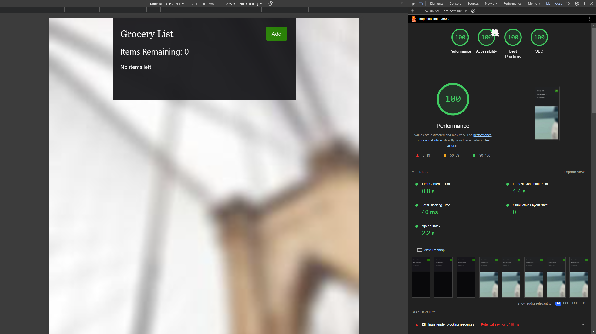

# Grocery List CRUD App

[](https://github.com/milliorn/Grocery-List/actions/workflows/pages/pages-build-deployment)  
[](https://github.com/milliorn/Grocery-List/actions/workflows/github-code-scanning/codeql)

Grocery List is a web application built using React, TypeScript, Vite, and Tailwind CSS. It provides a simple, intuitive interface for creating, editing, and deleting grocery items. All data is stored locally in the browser’s LocalStorage.

## Lighthouse



## Features

- Create a grocery list by adding items  
- Add quantity for each item  
- Update existing items  
- Remove items from the list  
- Responsive design for mobile and desktop  
- User-friendly alerts with SweetAlert2  
- Data persistence using LocalStorage  

## Technologies Used

- **React** & **TypeScript**: Component-based, type-safe UI  
- **Vite**: Fast development server and build tool  
- **Tailwind CSS**: Utility-first styling framework  
- **React Icons**: SVG icon library  
- **SweetAlert2**: Customizable alert dialogs  
- **uuid**: Unique ID generation  
- **LocalStorage API**: Browser storage  

## Getting Started

### Prerequisites

- Node.js v14+  
- npm or yarn  

### Installation

```bash
git clone https://github.com/milliorn/Grocery-List.git
cd Grocery-List
npm install
npm run dev
```

Open your browser and visit http://localhost:5173.

## Available Scripts

- `npm run dev` — Start Vite development server  
- `npm run build` — Run TypeScript build and Vite production build (`tsc -b && vite build`)  
- `npm run preview` — Preview production build locally (`vite preview`)  
- `npm run lint` — Run ESLint (`eslint .`)  
- `npm run prettier-check` — Check code formatting (`npx prettier . --check`)  
- `npm run prettier-write` — Format code (`npx prettier . --write`)  
- `npm run tsc-watch` — Watch TypeScript files and recompile on changes (`tsc -w`)  
- `npm run deploy-before` — Alias for build step before deployment (`npm run build`)  
- `npm run deploy` — Deploy `dist` directory to GitHub Pages (`gh-pages -d dist`)  

## Configuration

- **TypeScript**: `tsconfig.app.json` (React/TSX) & `tsconfig.node.json` (config files)  
- **ESLint**: Type-aware linting for `.tsx`, overrides for config files  
- **Prettier**: No semicolons, no single quotes, no trailing commas, `arrowParens: avoid`  

## License

This project is licensed under the MIT License. See [LICENSE](LICENSE) for details.

## Acknowledgements

- Inspired by the need for a simple grocery list tool  
- Thanks to all contributors for their improvements  

## Links

- [React Icons](https://github.com/react-icons/react-icons)  
- [SweetAlert2](https://github.com/sweetalert2/sweetalert2)  
- [uuid](https://github.com/uuidjs/uuid)  
- [Tailwind CSS](https://tailwindcss.com/)  
- [TypeScript](https://www.typescriptlang.org/)  
- [Picsum](https://picsum.photos/)
