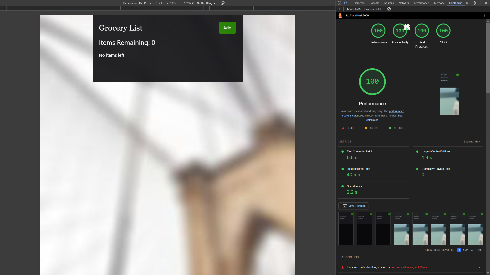

# Grocery List CRUD App

[](https://github.com/milliorn/Grocery-List/actions/workflows/pages/pages-build-deployment)
[](https://github.com/milliorn/Grocery-List/actions/workflows/github-code-scanning/codeql)

A fast, fully client-side grocery list manager built with **React 19**, **TypeScript**, **Vite**, and **Tailwind CSS v4**. Add items with quantities, edit them in place, and delete when done. Everything is saved to the browser's `localStorage` — no backend, no account, no network required after the initial page load.

**Live demo:** [https://milliorn.github.io/grocery-list/](https://milliorn.github.io/grocery-list/)

---

## Table of Contents

- [Lighthouse Score](#lighthouse-score)
- [Features](#features)
- [Tech Stack](#tech-stack)
- [Project Structure](#project-structure)
- [Prerequisites](#prerequisites)
- [Installation](#installation)
- [Running the App](#running-the-app)
- [Available Scripts](#available-scripts)
- [Architecture Overview](#architecture-overview)
  - [Component Tree](#component-tree)
  - [Component Reference](#component-reference)
  - [Data Model](#data-model)
  - [State Management](#state-management)
  - [Data Persistence](#data-persistence)
- [Configuration](#configuration)
  - [Vite](#vite)
  - [TypeScript](#typescript)
  - [Tailwind CSS v4](#tailwind-css-v4)
  - [PostCSS](#postcss)
  - [ESLint](#eslint)
  - [Prettier](#prettier)
- [Deployment](#deployment)
- [PWA Support](#pwa-support)
- [CI/CD and Automation](#cicd-and-automation)
- [Browser Support](#browser-support)
- [License](#license)
- [Acknowledgements](#acknowledgements)
- [Links](#links)

---

## Lighthouse Score

The application is optimized for performance, accessibility, best practices, and SEO.



---

## Features

- **Add items** — A togglable form lets you enter an item name and a quantity before saving.
- **Quantity tracking** — Every item stores a free-text quantity field (e.g. "2 loaves", "500 g", "1 dozen").
- **Edit items** — A SweetAlert2 dialog pre-fills the current values so you can update the name or quantity without deleting and re-adding.
- **Delete items** — Remove any item from the list with a single click.
- **Live item count** — The heading always shows the current number of items remaining in the list.
- **Form validation** — Client-side checks prevent saving incomplete entries. SweetAlert2 alerts tell you exactly what is missing.
- **Data persistence** — The list survives page refreshes because it is serialised to `localStorage`. If the storage is corrupt, it is removed gracefully on startup.
- **Storage error recovery** — If a write to `localStorage` fails (e.g. quota exceeded) the previous list is restored in memory and an error alert is shown.
- **Responsive layout** — Works on phones, tablets, and desktops. The content area has a maximum width of 672 px and scales text with Tailwind's responsive prefixes (`sm:`, `md:`, `lg:`, `xl:`, `2xl:`).
- **Progressive Web App (PWA)** — Includes a `manifest.json` with multiple icon sizes, a theme colour, and `display: standalone` so the app can be added to a device home screen.
- **Accessibility** — Icon buttons carry `aria-label` attributes so screen-reader users know their purpose.
- **Dark theme** — The UI uses a zinc-900 dark background with zinc-50 light text.
- **Random background photo** — A full-screen decorative image is served from [Picsum Photos](https://picsum.photos/) each render.

---

## Tech Stack

| Category             | Technology                  |
| -------------------- | --------------------------- |
| UI library           | React                       |
| Language             | TypeScript                  |
| Build tool           | Vite                        |
| React plugin         | @vitejs/plugin-react-swc    |
| CSS framework        | Tailwind CSS                |
| Tailwind Vite plugin | @tailwindcss/vite           |
| Tailwind PostCSS     | @tailwindcss/postcss        |
| PostCSS              | postcss                     |
| Autoprefixer         | autoprefixer                |
| Alert dialogs        | SweetAlert2                 |
| Icon library         | react-icons                 |
| Linter               | ESLint                      |
| TypeScript ESLint    | typescript-eslint           |
| React Hooks lint     | eslint-plugin-react-hooks   |
| React Refresh lint   | eslint-plugin-react-refresh |
| Formatter            | Prettier                    |
| Deployment           | gh-pages                    |

No backend, no database, no environment variables are required.

---

## Project Structure

```text
grocery-list/
├── .github/
│   ├── dependabot.yml          # Monthly dependency updates (npm + Actions)
│   └── workflows/
│       └── automerge.yml       # Auto-approve/merge Dependabot patch & minor PRs
├── public/
│   ├── android-chrome-192x192.png
│   ├── android-chrome-512x512.png
│   ├── apple-touch-icon.png
│   ├── favicon.ico
│   ├── lighthouse.png          # Lighthouse score screenshot shown in README
│   ├── manifest.json           # PWA manifest
│   └── robots.txt
├── src/
│   ├── components/
│   │   ├── AddGroceryItem.tsx  # Form for adding new items
│   │   ├── Button.tsx          # Reusable styled button (red / green)
│   │   ├── DeleteItem.tsx      # Red X icon button
│   │   ├── EditItem.tsx        # Blue pencil icon button
│   │   ├── GroceryItem.tsx     # Single item card (quantity + controls)
│   │   ├── Header.tsx          # App title + Add/Close toggle button
│   │   ├── ItemEditDelete.tsx  # Groups EditItem and DeleteItem together
│   │   ├── Items.tsx           # Renders the full list of GroceryItem cards
│   │   └── ItemsQuantity.tsx   # Displays item name and quantity text
│   ├── props/
│   │   ├── AddGroceryItemProps.ts
│   │   ├── ButtonProps.ts
│   │   ├── DeleteItemProps.ts
│   │   ├── EditItemProps.ts
│   │   ├── GroceryItem.ts      # Core GroceryItem type definition
│   │   ├── GroceryItemProps.ts
│   │   ├── HeaderProps.ts
│   │   ├── ItemEditDeleteProps.ts
│   │   ├── ItemsProps.ts
│   │   └── ItemsQuantityProps.ts
│   ├── styles/
│   │   └── index.css           # Tailwind import + body background styles
│   ├── App.tsx                 # Root component; all state and CRUD logic lives here
│   ├── constants.ts            # STORAGE_KEY constant for localStorage
│   ├── main.tsx                # React DOM root; mounts App in StrictMode
│   └── vite-env.d.ts           # Vite client type declarations
├── .gitignore
├── .prettierignore
├── .prettierrc                 # Prettier config: no semicolons, no trailing commas
├── eslint.config.js            # ESLint flat config (type-aware)
├── index.html                  # HTML entry point; mounts React via div#root
├── package.json
├── package-lock.json
├── postcss.config.cjs          # PostCSS config: Tailwind + autoprefixer
├── tsconfig.app.json           # TypeScript config for src/ (strict + extra checks)
├── tsconfig.json               # Composite root; references app + node configs
├── tsconfig.node.json          # TypeScript config for Vite config file (Node env)
└── vite.config.ts              # Vite config: React-SWC plugin, base path, PostCSS
```

---

## Prerequisites

| Requirement | Minimum version | Notes                                                                  |
| ----------- | --------------- | ---------------------------------------------------------------------- |
| Node.js     | 18.x            | React 19 and Vite 7 both require Node 18+. Node 20 LTS is recommended. |
| npm         | 9.x             | Bundled with Node 18+. Yarn or pnpm also work.                         |
| Git         | Any recent      | Only needed to clone the repository.                                   |

You do **not** need any API keys, environment variables, or accounts to run this project.

---

## Installation

### 1. Clone the repository

```bash
git clone https://github.com/milliorn/Grocery-List.git
cd Grocery-List
```

### 2. Install dependencies

```bash
npm install
```

This installs both the runtime dependencies (React, SweetAlert2, etc.) and all development tools (Vite, TypeScript, ESLint, Prettier, Tailwind CSS, etc.).

---

## Running the App

**Development server** (hot-reload via Vite + SWC):

```bash
npm run dev
```

Open [http://localhost:5173/grocery-list/](http://localhost:5173/grocery-list/) in your browser. The page updates instantly as you edit source files — no manual reload needed.

**Production preview** (test the built output locally):

```bash
npm run build
npm run preview
```

---

## Available Scripts

All scripts are defined in `package.json` and run with `npm run <script>`.

| Script           | Command                  | Description                                                                                     |
| ---------------- | ------------------------ | ----------------------------------------------------------------------------------------------- |
| `dev`            | `vite`                   | Starts the Vite development server with hot module replacement.                                 |
| `build`          | `tsc -b && vite build`   | Type-checks with TypeScript, then produces an optimised production bundle in `dist/`.           |
| `preview`        | `vite preview`           | Serves the contents of `dist/` locally so you can verify the production build before deploying. |
| `lint`           | `eslint .`               | Runs ESLint across all TypeScript/TSX files using the flat config in `eslint.config.js`.        |
| `prettier-check` | `npx prettier . --check` | Checks that all files match the Prettier formatting rules without changing them. Useful in CI.  |
| `prettier-write` | `npx prettier . --write` | Formats all files in place according to `.prettierrc`. Run this before committing.              |
| `tsc-watch`      | `tsc -w`                 | Watches TypeScript files and reports type errors on every save without building.                |
| `deploy-before`  | `npm run build`          | Alias for `build`. Called automatically by the deploy script to ensure the bundle is fresh.     |
| `deploy`         | `gh-pages -d dist`       | Pushes the `dist/` directory to the `gh-pages` branch, publishing the site to GitHub Pages.     |

---

## Architecture Overview

### Component Tree

```text
App                            <- State, CRUD logic, localStorage I/O
├── Header                     <- Title + toggle button
│   └── Button                 <- Reusable green/red button
├── AddGroceryItem             <- Togglable add form (conditionally rendered)
└── Items                      <- List container
    └── GroceryItem (x N)      <- One card per item
        ├── ItemsQuantity      <- Displays item name and quantity
        └── ItemEditDelete     <- Groups edit + delete icons
            ├── EditItem       <- Pencil icon -> opens SweetAlert2 edit dialog
            └── DeleteItem     <- X icon -> calls onDelete handler
```

### Component Reference

#### `App` (`src/App.tsx`)

The root component. It owns the entire application state and exposes CRUD callbacks to its children via props.

- **State**:
  - `items: GroceryItem[]` — the current grocery list.
  - `showItem: boolean` — controls whether the add form is visible.
- **On mount** (`useEffect`): reads `localStorage` with the key `"itemAdded"`, parses JSON, and initialises `items`. Invalid/corrupt data is silently removed from storage.
- **`createItem`**: generates a UUID, appends the new item, writes to `localStorage`, and shows a success alert. On storage failure it rolls back to the previous list.
- **`deleteItem`**: filters out the item by `id`, writes to `localStorage`, and alerts on success or failure.
- **`updateItem`** (async): opens a SweetAlert2 dialog pre-filled with the current values. On confirmation it maps over the list, replaces the matching item, and persists to `localStorage`.

#### `Header` (`src/components/Header.tsx`)

Displays the "Grocery List" heading and a `Button` that toggles the add form. When the form is open the button reads "Close" (red); when closed it reads "Add" (green).

#### `AddGroceryItem` (`src/components/AddGroceryItem.tsx`)

A controlled form with two text inputs: **Item** and **Quantity**. On submit it validates both fields:

- Both empty → error alert: "Add item and quantity or close the form."
- Only quantity filled → error alert: "Add your item."
- Only item filled → error alert: "Add your quantity."
- Both filled → calls `onSave` and resets the inputs.

#### `Items` (`src/components/Items.tsx`)

Maps the `items` array to a `GroceryItem` component for each entry, passing along `onDelete` and `onEdit` callbacks. Uses `item.id` as the React list key.

#### `GroceryItem` (`src/components/GroceryItem.tsx`)

A single item card laid out as a horizontal flex row. Renders `ItemsQuantity` on the left and `ItemEditDelete` on the right.

#### `ItemsQuantity` (`src/components/ItemsQuantity.tsx`)

Renders two labelled paragraphs:

```text
Item:     Bread
Quantity: 2 loaves
```

Responsive typography scales from the default size up through `sm:`, `md:`, `lg:`, and `xl:` breakpoints.

#### `ItemEditDelete` (`src/components/ItemEditDelete.tsx`)

A simple wrapper that renders `DeleteItem` above `EditItem`, grouping the two action controls for a single grocery item.

#### `EditItem` (`src/components/EditItem.tsx`)

Renders a blue pencil icon (`FaPencilAlt` from react-icons/fa) as a `<button>`. Clicking it calls `onEdit(item.id)`, which triggers the async SweetAlert2 dialog in `App`.

#### `DeleteItem` (`src/components/DeleteItem.tsx`)

Renders a red X icon (`FaTimes` from react-icons/fa) as a `<button>`. Clicking it calls `onDelete(item.id)`.

#### `Button` (`src/components/Button.tsx`)

A reusable button component accepting three props:

| Prop      | Type               | Description                                                             |
| --------- | ------------------ | ----------------------------------------------------------------------- |
| `color`   | `"red" \| "green"` | Selects the Tailwind background class (`bg-red-600` or `bg-green-800`). |
| `text`    | `string`           | Label rendered inside the button.                                       |
| `onClick` | `() => void`       | Click handler.                                                          |

### Data Model

Defined in `src/props/GroceryItem.ts`:

```typescript
export type GroceryItem = {
  id: string // UUID generated by crypto.randomUUID() (native browser API)
  text: string // Display name of the grocery item (e.g. "Bread")
  quantity: string // Free-text quantity (e.g. "2 loaves", "500 g", "1 dozen")
}
```

All prop interfaces live as individual files in `src/props/` to keep component files clean and make each interface independently importable.

### State Management

There is no external state management library. All state lives in `App.tsx` using React's built-in `useState` hook:

```text
items       -> GroceryItem[]   (the list)
showItem    -> boolean         (form visibility)
```

Callbacks (`createItem`, `deleteItem`, `updateItem`) are defined in `App` and passed down as props to the components that need them. This is a deliberate choice for a small application — no Redux, Zustand, or Context API overhead.

### Data Persistence

Items are stored in `localStorage` under the key `"itemAdded"` (defined in `src/constants.ts`).

**Read flow:**

1. On first render (`useEffect` with empty dependency array), `App` calls `localStorage.getItem("itemAdded")`.
2. If the value is not `null` and not empty, it is parsed with `JSON.parse` and used to initialise `items`.
3. If parsing throws (corrupt data), the key is removed and `items` stays as an empty array.

**Write flow (every mutation):**

1. State is updated optimistically.
2. `localStorage.setItem("itemAdded", JSON.stringify(updatedItems))` is called inside a `try/catch`.
3. On success, a SweetAlert2 success dialog is shown.
4. On failure (e.g. quota exceeded), the previous state snapshot is restored and an error dialog is shown.

---

## Configuration

### Vite

**File:** `vite.config.ts`

```typescript
import { defineConfig } from "vite"
import react from "@vitejs/plugin-react-swc"

export default defineConfig({
  plugins: [react()], // SWC-powered JSX transform + Fast Refresh
  css: {
    postcss: "./postcss.config.cjs" // Points PostCSS at the CJS config file
  },
  base: "/grocery-list/" // Required for GitHub Pages sub-path hosting
})
```

Key points:

- **SWC** replaces Babel as the JSX/TS transpiler, making builds and HMR significantly faster.
- The `base` option is set to `/grocery-list/` to match the GitHub Pages URL. If you self-host at a root domain, change this to `"/"`.

### TypeScript

Two TypeScript configs are used (project references pattern):

**`tsconfig.json`** — the composite root. It contains no compiler options of its own; it simply references the two child configs:

```json
{
  "files": [],
  "references": [
    { "path": "./tsconfig.app.json" },
    { "path": "./tsconfig.node.json" }
  ]
}
```

**`tsconfig.app.json`** — governs all files in `src/`. Key settings:

| Option                       | Value       | Effect                                                         |
| ---------------------------- | ----------- | -------------------------------------------------------------- |
| `target`                     | `ES2020`    | Output syntax (Vite transpiles further for older browsers)     |
| `strict`                     | `true`      | Enables the full TypeScript strict suite                       |
| `noEmit`                     | `true`      | TypeScript only type-checks; Vite handles bundling             |
| `jsx`                        | `react-jsx` | Uses the modern React JSX transform (no `import React` needed) |
| `moduleResolution`           | `bundler`   | Optimised for Vite/bundler environments                        |
| `exactOptionalPropertyTypes` | `true`      | Prevents assigning `undefined` to optional props accidentally  |
| `noImplicitReturns`          | `true`      | Every code path in a function must return a value              |
| `noUnusedLocals`             | `true`      | Errors on declared but unused variables                        |
| `noUnusedParameters`         | `true`      | Errors on declared but unused function parameters              |
| `useUnknownInCatchVariables` | `true`      | Catch clause variable typed as `unknown`, not `any`            |

**`tsconfig.node.json`** — governs `vite.config.ts` only. Targets the Node.js environment and uses `tsconfig.node.json` for project-service type information.

### Tailwind CSS v4

This project uses **Tailwind CSS v4**, which has a fundamentally different setup from v3:

- There is **no `tailwind.config.js`**. Configuration is handled by the plugins themselves.
- The CSS entry point (`src/styles/index.css`) uses a single import:

  ```css
  @import "tailwindcss";
  ```

- The Tailwind PostCSS plugin (`@tailwindcss/postcss`) is registered in `postcss.config.cjs`.

All Tailwind classes used in components are standard utility classes (no custom theme extensions or plugins).

### PostCSS

**File:** `postcss.config.cjs`

Written as a CommonJS module (`.cjs`) because it is loaded by Vite's PostCSS integration at build time in a Node context:

```javascript
module.exports = {
  plugins: [
    require("@tailwindcss/postcss"), // Processes Tailwind utilities
    require("autoprefixer") // Adds vendor prefixes for cross-browser CSS
  ]
}
```

### ESLint

**File:** `eslint.config.js` (flat config — ESLint v9+)

The configuration extends:

- `@eslint/js` recommended rules
- `typescript-eslint` recommended rules (type-aware)
- `eslint-plugin-react-hooks` recommended rules
- `eslint-plugin-react-refresh` (warns on non-component exports)

Additional strictness rules enabled:

| Rule                                               | Level | Effect                                        |
| -------------------------------------------------- | ----- | --------------------------------------------- |
| `eqeqeq`                                           | error | Require `===` / `!==`                         |
| `no-var`                                           | error | No `var`; use `let` or `const`                |
| `prefer-const`                                     | error | Use `const` when variable is never reassigned |
| `curly`                                            | error | Require braces for all control structures     |
| `@typescript-eslint/explicit-function-return-type` | warn  | Explicit return types on functions            |
| `@typescript-eslint/no-explicit-any`               | error | No `any` type                                 |
| `@typescript-eslint/strict-boolean-expressions`    | error | No unintended type coercions in conditions    |
| `@typescript-eslint/no-unsafe-assignment`          | error | No unsafe assignments                         |
| `@typescript-eslint/prefer-nullish-coalescing`     | error | Use `??` instead of `\|\|` where appropriate  |
| `@typescript-eslint/prefer-optional-chain`         | error | Use `?.` instead of chained `&&` checks       |

`vite.config.ts` has a separate override block that uses `tsconfig.node.json` and `globals.node` instead of `globals.browser`.

### Prettier

**File:** `.prettierrc`

```json
{
  "trailingComma": "none",
  "semi": false
}
```

All other options use Prettier's defaults: double quotes, 80-character print width, 2-space indentation.

**`.prettierignore`** excludes: `build/`, `coverage/`, `node_modules/`, `package-lock.json`, `public/`.

---

## Deployment

The application is deployed to **GitHub Pages** at:

```text
https://<your-github>.github.io/grocery-list/
```

### How it works

1. Run `npm run build` to produce a production bundle in `dist/`.
2. Run `npm run deploy` to push `dist/` to the `gh-pages` branch using the `gh-pages` npm package.
3. GitHub Pages serves the `gh-pages` branch automatically.

The `base: "/grocery-list/"` setting in `vite.config.ts` ensures all asset paths are prefixed correctly for the sub-path.

### One-command deploy

```bash
npm run deploy
```

This runs `deploy-before` (which runs `build`) first, then pushes to `gh-pages`.

### Self-hosting on a custom domain or root path

If you deploy to the root of a domain (e.g. `https://mysite.com/`) change `base` in `vite.config.ts` from `"/grocery-list/"` to `"/"`, rebuild, and deploy your `dist/` folder to your web server.

---

## PWA Support

The app includes a basic Progressive Web App setup:

| File                                | Purpose                                                |
| ----------------------------------- | ------------------------------------------------------ |
| `public/manifest.json`              | App name, icon definitions, theme colour, display mode |
| `public/favicon.ico`                | Browser tab icon (16x16 up to 64x64)                   |
| `public/apple-touch-icon.png`       | iOS home screen icon                                   |
| `public/android-chrome-192x192.png` | Android home screen icon (192 px)                      |
| `public/android-chrome-512x512.png` | Android splash / large icon (512 px)                   |

**`manifest.json` settings:**

| Property           | Value                            |
| ------------------ | -------------------------------- |
| `name`             | "Grocery List"                   |
| `short_name`       | "Grocery List"                   |
| `start_url`        | `/grocery-list/`                 |
| `display`          | `standalone` (no browser chrome) |
| `theme_color`      | `#18181b` (dark zinc)            |
| `background_color` | `#18181b`                        |

To install the app on a mobile device, open the live URL in Chrome or Safari and use "Add to Home Screen". The app will launch in standalone mode (no address bar).

> **Note:** This project does not include a Service Worker, so the PWA does not support offline mode.

---

## CI/CD and Automation

### GitHub Actions

**Pages build and deployment** — Triggered by pushes. Builds and publishes the site to GitHub Pages. Status shown by the badge at the top of this README.

**CodeQL** — Static security analysis. Scans for known vulnerability patterns in the JavaScript/TypeScript source. Status shown by the badge at the top of this README.

**Dependabot auto-merge** (`.github/workflows/automerge.yml`):

| Condition             | Action                          |
| --------------------- | ------------------------------- |
| Patch or minor update | Auto-approved and squash-merged |
| Major update          | PR is auto-closed with a label  |
| `update-type` is null | PR is auto-closed with a label  |

### Dependabot

**File:** `.github/dependabot.yml`

Dependabot runs on a **monthly** schedule for two ecosystems:

- `npm` — checks all Node.js dependencies. Major version updates are ignored; they require manual review.
- `github-actions` — checks all Actions versions used in workflows.

---

## Browser Support

The project targets **modern evergreen browsers** (Chrome, Firefox, Edge, Safari). The combination of Vite's ES module output, Autoprefixer, and the `ES2020` TypeScript target means:

- No Internet Explorer support.
- No polyfills are shipped.
- `localStorage` is used for persistence — all modern browsers support it.
- `crypto.randomUUID()` is used for ID generation. This sets the effective minimum versions:

| Browser | Minimum version | Release date  |
| ------- | --------------- | ------------- |
| Chrome  | 92              | July 2021     |
| Edge    | 92              | July 2021     |
| Firefox | 95              | December 2021 |
| Safari  | 15.4            | March 2022    |

---

## License

This project is licensed under the **MIT License**. See [LICENSE](LICENSE) for the full text.

---

## Acknowledgements

- Background images courtesy of [Picsum Photos](https://picsum.photos/) — a free, open-source random image service.
- Alert dialogs powered by [SweetAlert2](https://sweetalert2.github.io/).
- Icons from [React Icons](https://react-icons.github.io/react-icons/), specifically the Font Awesome 5 (`fa`) set.
- Scaffolded from the official Vite React-TS template.
- Thanks to all contributors and Dependabot for keeping dependencies current.

---

## Links

| Resource      | URL                                                                                      |
| ------------- | ---------------------------------------------------------------------------------------- |
| Live app      | [https://milliorn.github.io/grocery-list/](https://milliorn.github.io/grocery-list/)     |
| React         | [https://react.dev/](https://react.dev/)                                                 |
| Vite          | [https://vite.dev/](https://vite.dev/)                                                   |
| TypeScript    | [https://www.typescriptlang.org/](https://www.typescriptlang.org/)                       |
| Tailwind CSS  | [https://tailwindcss.com/](https://tailwindcss.com/)                                     |
| SweetAlert2   | [https://sweetalert2.github.io/](https://sweetalert2.github.io/)                         |
| React Icons   | [https://react-icons.github.io/react-icons/](https://react-icons.github.io/react-icons/) |
| Picsum Photos | [https://picsum.photos/](https://picsum.photos/)                                         |
| gh-pages      | [https://github.com/tschaub/gh-pages](https://github.com/tschaub/gh-pages)               |
